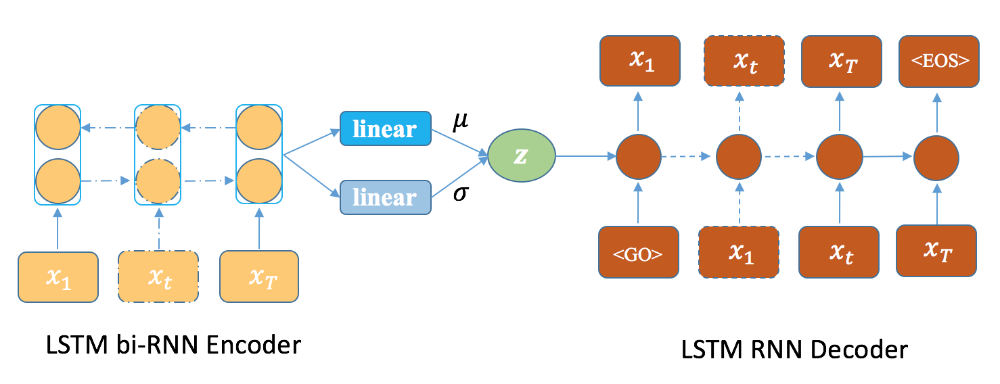

# mu-Forcing: Training Variational Recurrent Autoencoders for Text Generation
This repo contains the code and data of the following paper:
**mu-Forcing: Training Variational Recurrent Autoencoders for Text Generation**, *Dayiheng Liu, Xue Yang\*, Feng He, Yuanyuan Chen, Jiancheng Lv*, ACM Transactions on Asian and Low-Resource Language Information Processing. **TALLIP** 2019 [[arXiv]](https://arxiv.org/abs/1905.10072)

## Overview
<p align="center"></p>  

We propose an effective regularizer based approach to address the uninformative latent variables problem. The proposed method directly injects extra constraints on the posteriors of latent variables into the learning process of VRAE, which can flexibly and stably control the trade-off between the KL term and the reconstruction term, making the model learn dense and meaningful latent representations.

## Dependencies

- Jupyter notebook 4.4.0
- Python 3.6
- Tensorflow 1.6.0+
- Numpy

## Quick Start
`mu_Forcing.ipynb`: 
- Training: Run `util.fit(train_dir='Models/')` in `mu_Forcing.ipynb`
- Testing: Run `util.test()` in `mu_Forcing.ipynb` 
- Generating: Run `model.generate()` in `mu_Forcing.ipynb` 

## Trained Model
Download the trained models (with different mu values) from the following links:
```bash
https://drive.google.com/open?id=1QW52VZaGJprERnmtSk9x5Qg0UY8LmmfR
https://drive.google.com/open?id=1PjLjG-H2NfOQQk-bdpU4aNHBFbHYYrwa
https://drive.google.com/open?id=1Z8Pzr78Dikvo97Uj93V6COC2BBUDH2wH
https://drive.google.com/drive/folders/1LkRvhh1VvVCMSG89XkspZtDYnBz9eGuN
```

## Dataset
- The APRC dataset can be found in `Data/APRC`
- The CMSC dataset can be found in `Data/CSMC`   

Using `pickle.load()` to load the dataset in `X_indices.pkl` and the vocabulary in `w2id_id2w.pkl`
